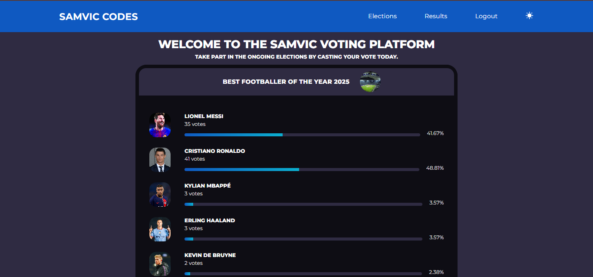
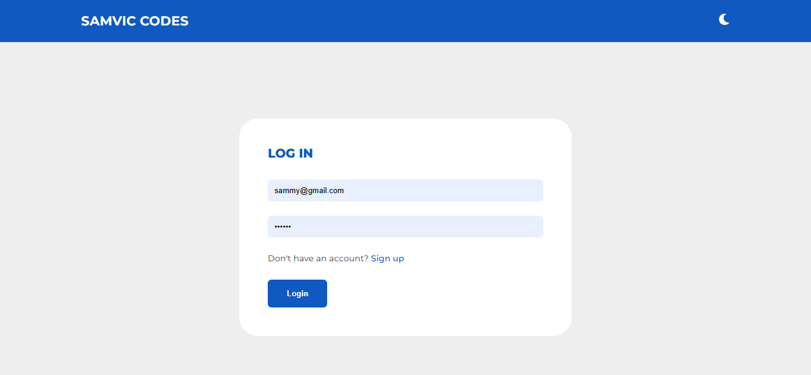
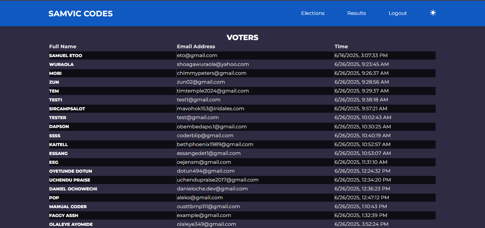
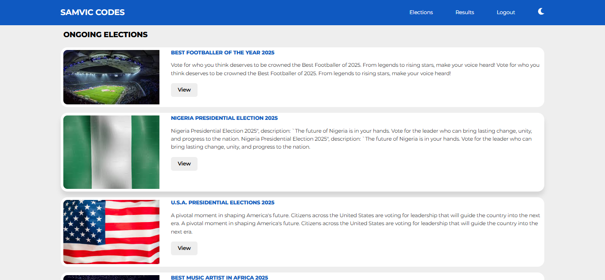
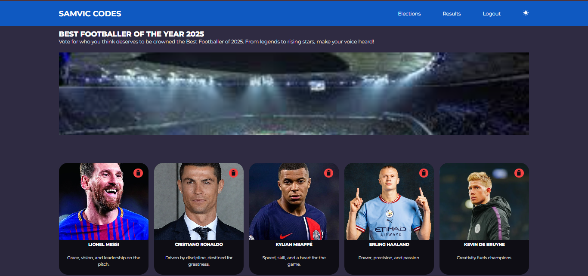

# 🗳️ SamVic Election - Multi-Election Voting Web App

A full-stack voting application built to ensure secure, transparent, and seamless voting experiences. SamVic Election allows users to participate in multiple elections with real-time result updates, while administrators can manage elections and candidates efficiently. Designed with a focus on data integrity, responsiveness, and user trust.

## 🚀 Live Demo

👉 [Visit the Website](https://samvicelection.vercel.app)

## 📸 Screenshots

---

## ✨ Features

- 🔐 **JWT Authentication** – Secure login and registration system.
- 🗳️ **Multi-election Voting** – Users can vote once per election, no duplication.
- 🌗 **Light/Dark Theme** – Toggleable UI themes for accessibility and preference.
- 🧑‍💼 **Admin Panel** – Manage users, elections, and candidates.
- ☁️ **Cloudinary Integration** – Upload and manage candidate images.
- 📱 **Responsive Design** – Fully responsive across devices.
- 🧠 **Mongoose Sessions & Relationships** – Ensures proper data structure and session handling.

---

## 🛠️ Tech Stack

**Frontend**: React.js, Redux Toolkit
**Backend**: Node.js, Express.js, MongoDB, Mongoose  
**Authentication**: JSON Web Tokens (JWT), Mongoose Sessions  
**Cloud & Media**: Cloudinary  
**Deployment**: Vercel (Frontend), Render (Backend)

---

## 🧪 Usage

- Register/login as a user to view and participate in elections.
- Cast your vote once per election.
- Admin users can create, edit, or delete elections and candidates.
- Uploaded images are securely handled via Cloudinary.

---

## 📈 Project Highlights

- Developed a secure voting system enabling over **100+ users** to participate in elections without vote duplication.
- Improved election transparency and user trust with real-time result updates.
- Delivered a responsive, mobile-friendly interface enhancing user accessibility and experience.

> Built with passion and purpose to simplify voting and increase transparency 🚀

---

---

## 👨🏽‍💻 About Me

I'm **Akpobasa Victor Samuel**, a passionate Full-Stack Developer.  
📫 Reach me: [LinkedIn](https://www.linkedin.com/in/samviccodes) | [Twitter](https://x.com/SamVicCodes)
